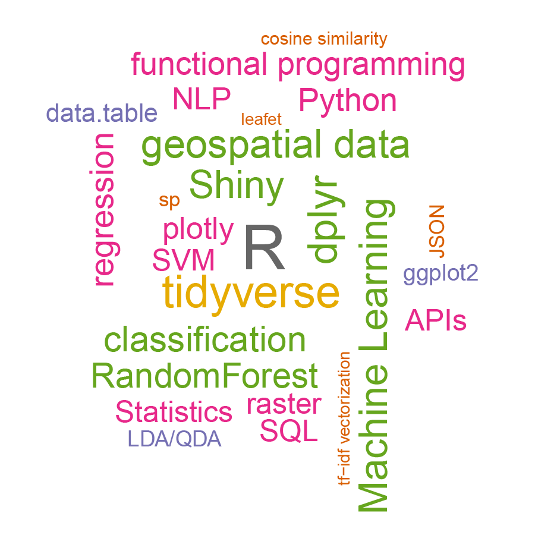

```{r setup, include=FALSE}
htmltools::tagList(rmarkdown::html_dependency_font_awesome())
```


<center><h1><b>RICH A. PAULOO</b></h1></center>
***  
<center>
  <i class="fa fa-globe" aria-hidden="true"></i> [richpauloo.github.io](https://richpauloo.github.io/) |
  <i class="fa fa-github" aria-hidden="true"></i> [richpauloo](https://github.com/richpauloo) |
  <i class="fa fa-envelope" aria-hidden="true"></i> rpauloo@ucdavis.edu
</center>

<!-- font awesome hack to make doc < 2MB in size -->
<!-- <center> -->
<!--    [richpauloo.github.io](https://richpauloo.github.io/) | -->
<!--    [richpauloo](https://github.com/richpauloo) | -->
<!--    rpauloo@ucdavis.edu | -->
<!--    740 Miller Drive · Davis, CA 95616 -->
<!-- </center> -->

***  

```{r, echo = FALSE, warning=FALSE, error=FALSE, message=FALSE}
library(r2d3)
r2d3(data = c(), d3_version = 4, script = "voronoi.js", width = '100%', height = 100)
```

<!-- **OBJECTIVE**: Data Scientist Intern, PhD, 2019 - Mountain View, New York or Seattle -->

**Hydrogeophysics PhD (March 2020) & Data Scientist** with demonstrated success in two data science competitions hosted by NASA and the West Big Data Hub. Possess 3+ years of experience in scripting non-routine, quantitative analysis of geospatial, tabular, natural language, and timeseries data. Highly curious and creative thinker skilled in end-to-end research design, from data gathering and processing, to statistics, machine learning, data visualization, and communication. Possess strong interpersonal, presentation, writing, and oratory skills. Able to grasp new concepts and ideas quickly. Motivated by learning new skills and making a difference in the world.  

***

## EDUCATION

**University of California, Davis**, *Ph.D. Hydrogeophysics* \hfill (March 2020)  
**University of California, Berkeley**, *B.S. Biology & minor in Conflict Resolution* \hfill (2011)  


***  

## DATA SCIENCE EXPERIENCE 

<div id="textbox">
  <p class="alignleft"><b>Freelance Data Scientist</b></p>
  <p class="alignright">2017-present</p>
</div>
<br>

<!-- **Freelance Data Scientist**  \hfill 2017-present -->

* Winner, [California Water Data Challenge](http://waterchallenge.data.ca.gov/) (**$1,500 Prize**)   [[view project]](https://richpauloo.github.io/flexdash.html) 

* Runner-Up, [NASA Data Visualization Competition](https://education.agu.org/grants/data-visualization-storytelling-competition/award-information/past-winners/) (**$1,400 Prize**)   [[view slides]](https://docs.google.com/presentation/d/1S7R3jKaEuxHq0A5ChdtH-azmBMsICpn702QH152Zkrc/edit?usp=sharing) 

* Data Engineer & Developer for [UC Water](http://ucwater.org/)  
    + [Real Time Aquifer Monitoring](http://ucwater.org/gw_obs/): End-to-end data extraction-transformation-visualization pipeline scraping monitoring well data sent via telemetry. Includes automated report generation and distribution.  
    + [OSWCR Spatial Database Query Tool](http://ucwater.org/oswcr/): Spatial database that takes a user defined shapefile and returns the subset of points within that shapefile.    
    + [Abstr](https://richpauloo.shinyapps.io/abstr/): Interactively swipe through 20,000+ scientific abstracts from the 2017 American Geophysical Union Fall Meeting.     
    + [Groundwater Quality Data Explorer](https://richpauloo.shinyapps.io/tds_leaflet/): Interactive map of multiple groundwater quality databases.    
    + [Word Cloud Generator](https://richpauloo.shinyapps.io/word_cloud_app/): Enter a `.txt` file and this app returns a word cloud of the most frequently-used non-stop-words.   

* Data Science Blogger (**> 1.2k monthly users**) [[view blog]](https://richpauloo.github.io/)

***  

## TECHNICAL SKILLS

```{r, eval = FALSE}
# read csv of skills, add normally distributed weights, and plot wordcloud
readr::read_csv("C:/Users/rpauloo/Desktop/skills.csv") %>%
  dplyr::mutate(n = rnorm(nrow(.), mean = 50, sd = 19)) %>%
  with(wordcloud::wordcloud(skill, n, colors = brewer.pal(8, "Dark2")))
```

<center>
```{r, out.width="40%", echo = FALSE}

```
</center>


***

## EMPLOYMENT

**University of California, Davis**
 
<ul>
  <li><p class="alignleft">National Science Foundation Fellow in [Climate Change, Water, and Society](http://ccwas.ucdavis.edu/)</p><p class="alignright">2015--2017</p></li><br>
  <li><p class="alignleft">Researcher for [U.S./China Clean Energy Research Center](https://cerc-wet.berkeley.edu/)</p><p class="alignright">2015--present</p></li><br>
  <li><p class="alignleft">Data Engineer & Developer for [UC Water](http://ucwater.org/)</p><p class="alignright">2017--present</p></li><br>
  <li><p class="alignleft">Data Science Consultant at the [UC Davis Data Science Initiative](http://dsi.ucdavis.edu/)</p><p class="alignright">2018--present</p></li><br>
  <li><p class="alignleft">Hydrologic Sciences Graduate Group [Developer/Webmaster](https://hsgg.ucdavis.edu)</p><p class="alignright">2017--present</p></li><br>
  <li><p class="alignleft">Graduate Student Assembly Representative</p><p class="alignright">2016--2018</p></li>
</ul>
  
 

 
**National Geographic:**

<ul>
  <li><p class="alignleft">Student Expedition Leader (Thailand)</p><p class="alignright">2016</p></li>
</ul>


**NatureBridge: Yosemite National Park & Golden Gate National Recreation Area**

<ul>
  <li><p class="alignleft">Site Manager</p><p class="alignright">2014--2015</p></li><br>
  <li><p class="alignleft">Environmental Science Educator</p><p class="alignright">2013--2014</p></li>
</ul>

*** 

## GRANTS & AWARDS

<ul>
  <li><p class="alignleft">**($500)** *Ken Tanji Service Award*, UC Davis</p><p class="alignright">2018</p></li><br>
  <li><p class="alignleft">*Best Innovative Tool Development*, UC Water Annual Meeting  [[tool]](http://ucwater.org/oswcr/)</p><p class="alignright">2018</p></li><br>
  <li><p class="alignleft"> **($1,500)** *CA Water Data Challenge Winner*, 2018 CA Water Data Challenge [[project](https://richpauloo.github.io/flexdash.html)]</p><p class="alignright">2018</p></li><br>
  <li><p class="alignleft">**($1,400)** *NASA Data Visualization Competition Runner Up* [[project](https://github.com/richpauloo/richpauloo.github.io/blob/master/presentations/pauloo_hyperwall_no_lines.pdf)]</p><p class="alignright">2018</p></li><br>
  <li><p class="alignleft">**($1,000)** *Early Career Data Science Researcher Award*, West Big Data Hub</p><p class="alignright">2018</p></li><br>
  <li><p class="alignleft">*NSF-GRFP Honorable Mention*, National Science Foundation</p><p class="alignright">2016</p></li><br>
  <li><p class="alignleft">**($111,000)** *NSF-IGERT in Climate Change, Water, and Society*, National Science Foundation</p><p class="alignright">2015</p></li>
</ul>


***

## PUBLICATIONS IN PROGRESS

<!-- ### **Journal Articles** -->

Pauloo, R., C. Henri, Z. Guo, G.E. Fogg 2019. "Upscaling Regional, 3D, Non-Fickian Solute Transport with 2D Equivalent Models." *Water Resources Research* *(not yet submitted)*

Pauloo, R., A. Escriva-Bou, A. Fencl, H. Guillon 2019. "Predicting Domestic Well Failure and Drought Vulnerability in California's Central Valley." *Regional Environmental Change* *(not yet submitted)*

Pauloo, R., Z. Guo, G.E. Fogg 2019. "Groundwater Salinization Resulting from Open-to-Closed Basin Conversion in an Agricultural Basin." *Advances in Water Resources* *(not yet submitted)*

*** 

## PRESENTATIONS

**2018. Pauloo, G.E. Fogg, R., Z. Guo, C.V. Henri** "Upscaling Regional, 3D, Non-Fickian Solute Transport with 2D Equivalent Models." American Geophysical Union. Final Paper Number H43I-2582. Washington, DC. 13 Dec. 

**2018, Pauloo, R.** "An Interactive Mapping Interface to the California Online State Well Completion Report Database" UC Water Annual Meeting. Sacramento, CA. 25 Oct. [[view presentation]](https://shiny.lawr.ucdavis.edu/shiny/oswcrd/)  

**2018, Pauloo, R., A. Escriva-Bou, A. Fencl, H. Guillon** "Domestic Well Vulnerability to Drought in California's Central Valley" California Water Data Challenge Awards Summit. Los Angeles, CA. 18 Oct.  

**2018. Pauloo, R., A. Escriva-Bou, A. Fencl, H. Guillon** "Data-Driven Prediction of Domestic Well Failure in California, and Forecasting Future Well Failure with Machine Learning Models" CA Water Data Summit. Los Angeles, CA. 23 Sept.  

**2018. Pauloo, R.** "Regional Groundwater Quantity and Quality Models" Stanford University. Palo Alto, CA. 24 May.  

**2017. Pauloo, G.E. Fogg, R., Z. Guo, C.V. Henri** "Basin Scale Groundwater Quality Management Modeling: Methods to Upscale the Advection Dispersion Equation." American Geophysical Union. Final Paper Number H51G-1360. New Orleans, LA. 14 Dec. [[view poster]](https://github.com/richpauloo/richpauloo.github.io/blob/master/presentations/agu_pauloo_2017_small.pdf)  

**2017. Pauloo, R., G.E. Fogg, E. Goharian, J.D. Herman** "How to Maximize Total Water Storage in California." UC Water Annual Retreat. Davis, CA. 21--22 Sept. 

**2016. Pauloo, R., G.E. Fogg, Z. Guo** "Water Resource Vulnerability to Groundwater Salinization in Closed Basin Aquifers." American Geophysical Union. Final Paper Number H33F-1610. San Francisco, CA. 14 Dec. 

**2016. Pauloo, R., G.E. Fogg, Z. Guo** "Investigating Groundwater Sustainability and Water Quality Degradation in California's Tulare Basin using a Simple Mixing Model." Groundwater Resources Association Annual Meeting. Concord, CA. 28 Sept.

**2016. Pauloo, R., G.E. Fogg, Z. Guo** "Groundwater Salinization due to Hydraulic Closure in Tulare Basin over long time scales." Toward Sustainable Groundwater in Agriculture. Burlingame, CA. 28 June.

**2015. Pauloo, R., P. Marielle** "The Past Present and Future: Long-term climate trends and water management history in California." Water Scarcity in the West: Past Present and Future. Davis, CA. 12--13 April. [[view poster]](https://github.com/richpauloo/richpauloo.github.io/blob/master/presentations/2017_04_18_weathering_change_poster.pdf)  


*** 

## ORGANIZATION & LEADERSHIP

**Team Lead, California Water Data Challenge, May - Oct. 2018** [Domestic Well Vulnerability to Drought in California's Central Valley](https://richpauloo.github.io/flexdash.html)  

**Session Co-Chair, American Geophysical Union, Dec. 2016.** [Integration of Climate, Hydrology, Social Science, and Water Management: Connecting Hydroclimate Models with Stakeholder Need](https://agu.confex.com/agu/fm16/meetingapp.cgi/Session/13694)  

**Conference Co-Organizer, April 2016.** [Weathering Change: Impact of Climate Change and SGMA on CA Water](https://watershed.ucdavis.edu/news/2016/03/09/april-4-5-weathering-change-impact-climate-change-and-sgma-ca-water-conference)  

***  

## TRAINING  

##### ANALYSIS

<ul>
  <li><p class="alignleft">Stanford ICME Summer School in Machine Learning and Deep Learning. Palo Alto, CA.</p><p class="alignright">2018</p></li><br>
  <li><p class="alignleft">Software Carpentries Instructor Training. Davis, CA.</p><p class="alignright">2018</p></li><br>
  <li><p class="alignleft">conf::RStudio. San Diego, CA.</p><p class="alignright">2018</p></li><br>
  <li><p class="alignleft">Eawag Summer School in Mathematical Modeling of Environmental Systems. Dubendorf, Switzerland.</p><p class="alignright">2017</p></li><br>
  <li><p class="alignleft">C2VSim groundwater modeling training. San Luis Obispo, CA.</p><p class="alignright">2016</p></li><br>
</ul>


##### OTHER

* First Responder - certification through NOLS valid through June 2019.  

***  

# COMMUNICATION & OUTREACH

* [*various topics*](https://richpauloo.github.io), Personal Blog   
* [*Eastern San Joaquin Valley and other CA drinking water supplies at risk in the next drought*](https://californiawaterblog.com/2018/11/12/domestic-well-vulnerability-to-drought-in-californias-central-valley/), California Water Blog  

***

## LANGUAGES

* Spanish (elementary)  
* Portuguese (elementary)  

*** 

## REFERENCES

Available upon request

***  
<!-- font awesome hack to make doc < 2MB in size -->

<!-- <center> -->
<!-- <h5>Made with  &    by Rich A. Pauloo</h5> -->
<!-- </center> -->

<center>
<h5>Made with <i class="fa fa-heart" aria-hidden="true"></i> & <i class="fa fa-coffee" aria-hidden="true"></i> by Rich A. Pauloo</h5>
</center>

<!-- <center> -->
<!--    [richpauloo.github.io](https://richpauloo.github.io/) | -->
<!--    [richpauloo](https://github.com/richpauloo) | -->
<!--    rpauloo@ucdavis.edu | -->
<!--    740 Miller Drive · Davis, CA 95616 -->
<!-- </center> -->

<center>
  <i class="fa fa-globe" aria-hidden="true"></i> [richpauloo.github.io](https://richpauloo.github.io/) |
  <i class="fa fa-github" aria-hidden="true"></i> [richpauloo](https://github.com/richpauloo) |
  <i class="fa fa-envelope" aria-hidden="true"></i> rpauloo@ucdavis.edu
</center>

<br>
<br>


